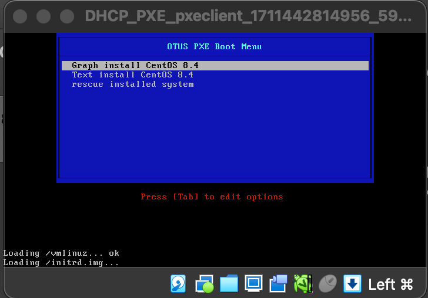

# DHCP_PXE

### Цель:
Установка и настройка DHCP, TFTP, PXE загрузчика и автоматической загрузки.  
  
### Введение
Бывают ситуации, когда ИТ-специалисту потребуется переустановить ОС на большом количестве хостов. Переустановка вручную потребует от специалиста большого количества времени. В этот момент стоит обратить внимание на PXE.
PXE (Preboot eXecution Environment) — это набор протоколов, которые позволяют загрузить хост из сети. Для загрузки будет использоваться сетевая карта хоста.
Для PXE требуется:
- со стороны клиента (хоста на котором будем устанавливать или загружать ОС):
- сетевая карта, которая поддерживает стандарт PXE:
- со стороны сервера:
   - DHCP-сервер;
   - TFTP-сервер.
  
TFTP (Trivial File Transfer Protocol) — простой протокол передачи файлов, используется главным образом для первоначальной загрузки бездисковых рабочих станций. Основная задача протокола TFTP — отправка указанных файлов клиенту.  
TFTP работает на 69 UDP порту. TFTP — очень простой протокол, у него нет аутентификации, возможности удаления файлов и т д. Протокол может только отправлять запросы на чтение и запись…  
  
DHCP (Dynamic Host Configuration Protocol) — протокол динамической настройки узла, позволяет сетевым устройствам автоматически получать IP-адрес и другие параметры, необходимые для работы в сети TCP/IP.  
Протокол DHCP пришёл на смену протоколу BOOTP. DHCP сохраняет обратную совместимость с BOOTP. Основное отличие протоколов заключается в том, что протокол DHCP помимо IP-адреса может отправлять клиенту дополнительные опции (маску подсети, адреса DNS-серверов, имя домена, адрес TFTP-сервера).  
  
Протокол DHCP использует следующие порты:
- UDP 67 на сервере;
- UDP 68 на клиенте.
  
Также DHCP позволяет DHCP-клиенту отправить ответом опции для DHCP-сервера.
  
Через DHCP мы можем передать клиенту адрес PXE-сервера и имя файла, к которому мы будем обращаться.
  
### Описание работ
  
В рамках подготвки проекта был подготовлен Vagrantfile для автоматизированного конфигурирования стенда, с учетом выполение подготовки pxeserver с использованием ansible. Для чего в Vagrantfile, в рамках описания конфигурации pxeserver, был добавлен блок:
```
   server.vm.provision "ansible" do |ansible|  
      ansible.playbook = "ansible/playbook.yml"  
   end  
```
  
Настройка сервера предусматривает:  
  - настройка Web-сервера для того, чтобы отдавать файлы по HTTP нам потребуется настроенный веб-сервер;  
  - настройка TFTP-сервера, который потребуется для отправки первичных файлов загрузки;  
  - настройка DHCP-сервера, которая предусматривает:  
      1. Установку DHCP-сервера: ```yum install dhcp-server```  
      2. Правку конфигурационного файла: ```vi /etc/dhcp/dhcpd.conf```  

В результате можно будет наблюдать загрузку меню  

  
Если не хочется вручную настраивать каждую установку, то мы можем автоматизировать этот процесс с помощью файла автоматиеской установки (kickstart file) ``` vi /iso/ks.cfg ```. 
Файл должен содержать следующую информацию:
  ```
   #version=RHEL8
   #Использование в установке только диска /dev/sda
   ignoredisk --only-use=sda
   autopart --type=lvm
   #Очистка информации о партициях
   clearpart --all --initlabel --drives=sda
   #Использование графической установки
   graphical
   #Установка английской раскладки клавиатуры
   keyboard --vckeymap=us --xlayouts='us'
   #Установка языка системы
   lang en_US.UTF-8
   #Добавление репозитория
   url —url=http://10.0.0.20/centos8/BaseOS/
   #Сетевые настройки
   network  --bootproto=dhcp --device=enp0s3 --ipv6=auto --activate
   network  --bootproto=dhcp --device=enp0s8 --onboot=off --ipv6=auto --activate
   network  --hostname=otus-pxe-client
   #Устанвка пароля root-пользователю (Указан SHA-512 hash пароля 123)
   rootpw --iscrypted $6$sJgo6Hg5zXBwkkI8$btrEoWAb5FxKhajagWR49XM4EAOfO/Dr5bMrLOkGe3KkMYdsh7T3MU5mYwY2TIMJpVKckAwnZFs2ltUJ1abOZ.
   firstboot --enable
   #Не настраиваем X Window System
   skipx
   #Настраиваем системные службы
   services --enabled="chronyd"
   #Указываем часовой пояс
   timezone Europe/Moscow --isUtc
   user --groups=wheel --name=val --password=$6$ihX1bMEoO3TxaCiL$OBDSCuYEpqPmkFmMPVvI3JZlCVRfC4Nw6oUoPG0RGuq2g5BjQBKNboPjM44.0lJGBc7OdWlL17B3qzgHX2v// --iscrypted --gecos="val"
  
   %packages
   @^minimal-environment
   kexec-tools
  
   %end
  
   %addon com_redhat_kdump --enable --reserve-mb='auto'
  
   %end
  
   %anaconda
   pwpolicy root --minlen=6 --minquality=1 --notstrict --nochanges --notempty
   pwpolicy user --minlen=6 --minquality=1 --notstrict --nochanges --emptyok
   pwpolicy luks --minlen=6 --minquality=1 --notstrict --nochanges --notempty
   %end
```
  
Также потребуется внести изменения в меню загрузки, добавив следующие параметры в файл  ``` vi /var/lib/tftpboot/pxelinux.cfg/default  ```:
```
   default menu.c32
   prompt 0
   timeout 150
   ONTIME local
   menu title OTUS PXE Boot Menu
         label 1
         menu label ^ Graph install CentOS 8.4
         kernel /vmlinuz
         initrd /initrd.img
         append ip=enp0s3:dhcp inst.repo=http://10.0.0.20/centos8
         label 2
         menu label ^ Text install CentOS 8.4
         kernel /vmlinuz
         initrd /initrd.img
         append ip=enp0s3:dhcp inst.repo=http://10.0.0.20/centos8 text
         label 3
         menu label ^ rescue installed system
         kernel /vmlinuz
         initrd /initrd.img
         append ip=enp0s3:dhcp inst.repo=http://10.0.0.20/centos8 rescue
         label 4
         menu label ^ Auto-install CentOS 8.4
         #Загрузка данного варианта по умолчанию
         menu default
         kernel /vmlinuz
         initrd /initrd.img
         append ip=enp0s3:dhcp inst.ks=http://10.0.0.20/centos8/ks.cfg inst.repo=http://10.0.0.20/centos8/
```
P.S.:  Нужно учесть, что так как в процессе работы playbook происходит скачивание образа ОС, процесс конфигурирования занимает довольно продолжительное время.  
Для сокращения времени, можно разместить необходимый образ в templates/iso и указать путь для него в строке блока "Download ISO image CentOS 8.4.2105" файла playbook.yml, предварительно разкомментировав его и закомментировать одноименный блок, который отвечает за загрузку образа в сети интернет.
 